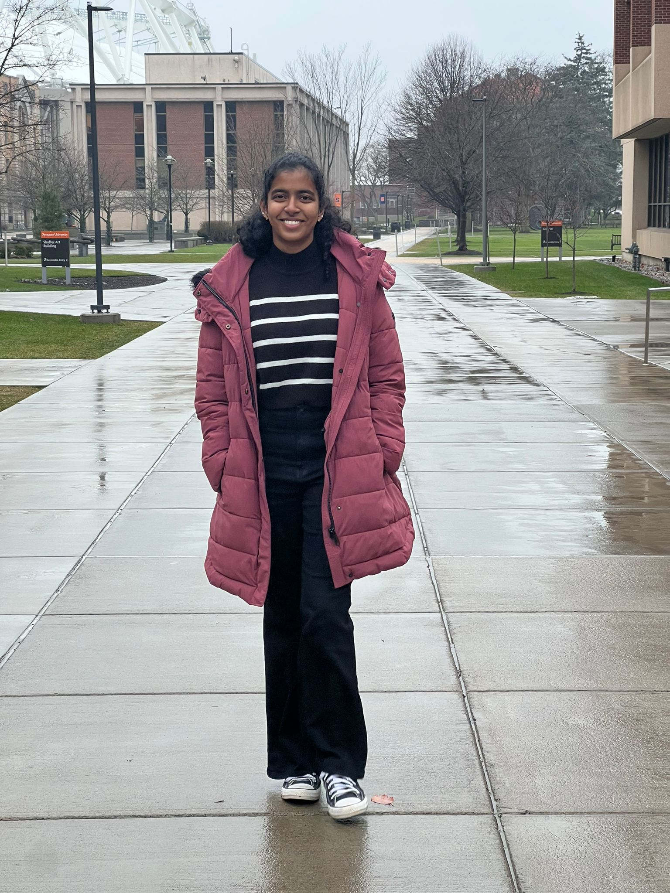

# Varsha Pusapati

Books are friends who never leave your side. I find this saying to be very true as books have always been there for me. I enjoy reading books. One of my favorite book is ***YOU CAN WIN*** , It is a self-help book by Shiv Khera, first published in 1998. The book is focused on providing practical and motivational advice to help us achieve success in our personal and professional lives. One of the strengths of this book iscits emphasis on practical application.

